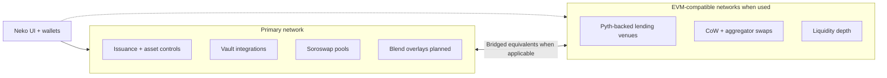

import { VideoPlaceholder } from "/snippets/video-placeholder.mdx";

## The primary network

Neko is built around one primary network for low fees and fast finality. Issuance-friendly assets, everyday wallets, and the live mainnet experience all anchor here first.

## Where EVM-compatible networks fit in

For some features, Neko also connects to EVM-compatible networks (for example liquidity connectors used from Expert flows). Those balances and fee currencies are separate from the primary network even when one dashboard sums them.

## What the diagram shows

Bridged assets add timing and trust rules. Read issuer notes when wraps power a strategy.

## In the app

Keep **XLM** funded in your wallet. If you use EVM connectors from Expert flows, keep each network's gas token funded too.

<Tip>Budget gas on both sides only when you actually use both.</Tip>

<VideoPlaceholder topic="How the primary and EVM networks split inside Neko" />

{/* VIDEO_PLACEHOLDER: How the primary and EVM networks split inside Neko, 60–90s walkthrough */}
